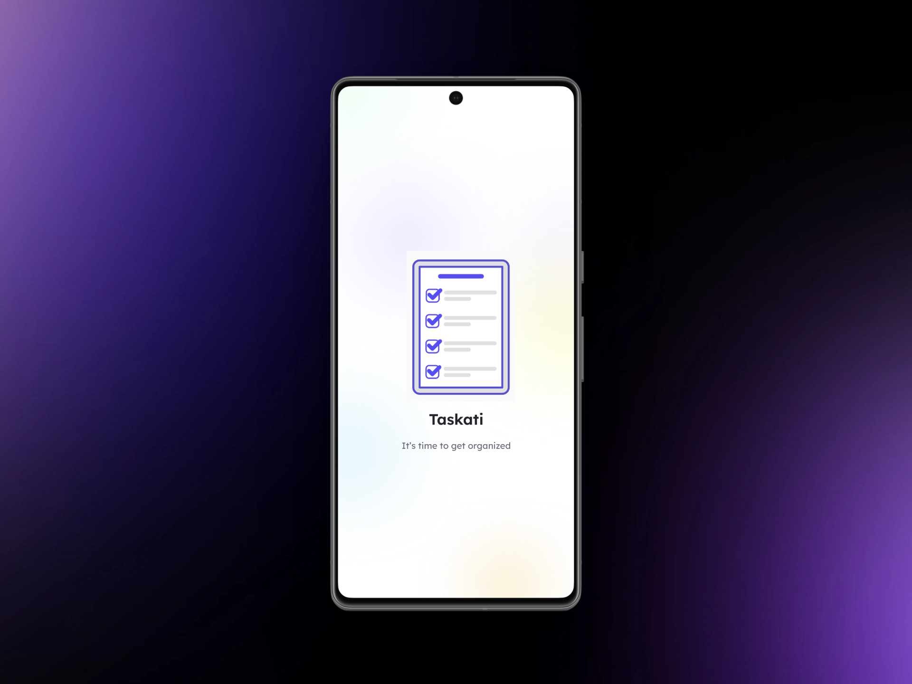
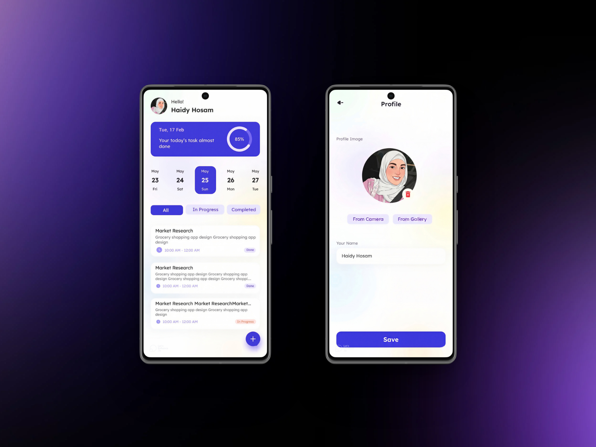
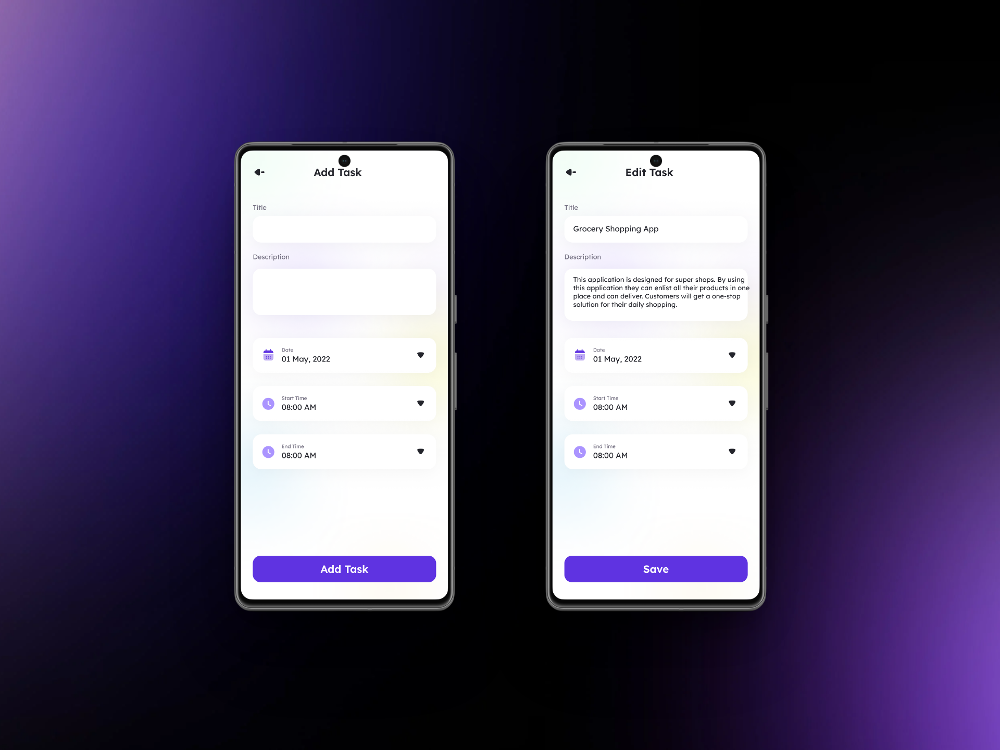

# Taskati

Taskati is a modern Flutter-based task management application that helps users organize their daily tasks, manage projects efficiently, and stay productive through a clean and intuitive interface.
## Features

* **Task Management:** Easily add, edit, and organize your tasks and projects.
* **Intuitive Interface:** A clean and user-friendly design to manage your daily workflow.
* **Onboarding Experience:** A smooth start for new users to get familiar with the app quickly.
* **Dark Theme:** Fully supports a dark theme for a better viewing experience in low-light environments.
* **Profile Management:** Keep track of your user profile and settings.

## Tech Stack

- Flutter
- Dart
- Material UI
- Image Picker
- State Management 

## Screenshots

Here are some screenshots of the application:

### Onboarding - Splash Screen

  

### Home Screen and Adding Projects / Tasks

  
  

## Getting Started

This project is a starting point for a Flutter application.

A few resources to get you started if this is your first Flutter project:

- [Lab: Write your first Flutter app](https://docs.flutter.dev/get-started/codelab)
- [Cookbook: Useful Flutter samples](https://docs.flutter.dev/cookbook)

